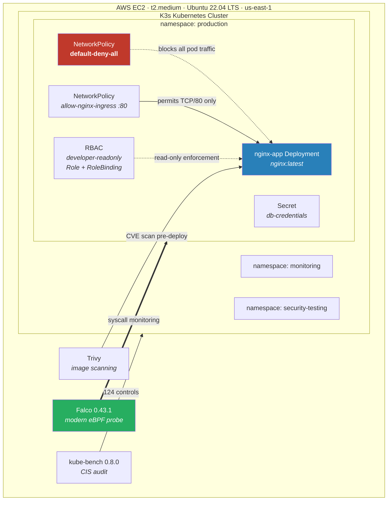

# Kubernetes Security Hardening & Runtime Threat Detection Lab


## Project Overview

A hands-on cloud security lab demonstrating Kubernetes security hardening, runtime threat detection, and container vulnerability management on AWS EC2. This project replicates real-world cloud security workflows used by Cloud Security Engineers and SOC Analysts protecting containerised infrastructure.

## Key Results

| Security Control | Finding |
|---|---|
| Falco Runtime Detection | 4 real alerts captured - 2 shell spawns in container + 2 sensitive file reads on /etc/shadow |
| Container Image CVE Exposure | Trivy scan surfaced 113 HIGH+CRITICAL CVEs in the legacy `nginx:1.14` base image; establishing an image-currency standard cut that to 20 |
| CRITICAL CVEs Specifically | Reduced from 31 to 2 (93.5% reduction) between image versions |
| CIS Benchmark Audit | 7 PASS / 61 FAIL / 56 WARN across 124 checks - all FAIL items documented |
| RBAC Enforcement | developer-user blocked from delete/create, read-only access confirmed |
| Network Policy | Zero-trust default-deny-all applied - selective allow for port 80 only |

## Security Controls Implemented

| Control | Tool | Purpose |
|---|---|---|
| Access Control | Kubernetes RBAC | Least-privilege role enforcement |
| Network Segmentation | NetworkPolicy | Zero-trust pod isolation |
| Runtime Threat Detection | Falco 0.43.1 | Real-time container activity monitoring |
| Image Vulnerability Scanning | Trivy | CVE detection before deployment |
| CIS Benchmark Audit | kube-bench 0.8.0 | Cluster compliance validation |
| Secret Management | Kubernetes Secrets | Credential isolation from application code |

## Architecture



## Falco Runtime Security Alerts (Real Output - May 11, 2026)

Falco detected the following security events during simulated attack scenarios:

```
07:32:01 NOTICE  Shell spawned in container with attached terminal
                 container=nginx | pod=nginx-app-5d665df68-qzlwr | ns=production
                 user=root | command=bash | parent=runc

07:33:03 WARNING Sensitive file opened for reading by non-trusted program
                 file=/etc/shadow | container=nginx | ns=production
                 user=root | command=cat /etc/shadow

07:36:59 WARNING Sensitive file opened for reading by non-trusted program
                 file=/etc/shadow | container=nginx | ns=production
                 user=root | command=cat /etc/shadow

07:37:10 NOTICE  Shell spawned in container with attached terminal
                 container=nginx | pod=nginx-app-5d665df68-qzlwr | ns=production
                 user=root | command=bash | parent=containerd-shim
```

### MITRE ATT&CK Mapping

| Falco alert | Technique | Tactic |
|---|---|---|
| Shell spawned in container with attached terminal | [T1059.004](https://attack.mitre.org/techniques/T1059/004/) — Command and Scripting Interpreter: Unix Shell | Execution |
| Sensitive file read on `/etc/shadow` | [T1003.008](https://attack.mitre.org/techniques/T1003/008/) — OS Credential Dumping: /etc/passwd and /etc/shadow | Credential Access |
| Interactive shell in a running container | [T1610](https://attack.mitre.org/techniques/T1610/) — Deploy Container *(behaviour consistent with container escape attempts)* | Defense Evasion |

**SOC relevance.** A shell spawning inside a running container is a high-fidelity IOC — a correctly built container image has no reason to run `bash` interactively in production. `/etc/shadow` access is unambiguous credential harvesting. Both are Tier-1 escalation triggers, and both were caught by runtime syscall monitoring rather than by scanning, which is the distinction between detecting an attack in progress and detecting a vulnerability that might be attacked.

## Container Image Vulnerability Comparison (Trivy)

| Severity | nginx:1.14 (outdated) | nginx:latest | Change |
|---|---|---|---|
| CRITICAL | 31 | 2 | 93.5% reduction |
| HIGH | 82 | 18 | 78.0% reduction |
| MEDIUM | 54 | 89 | Increased (new CVEs disclosed) |
| LOW | 43 | 117 | Increased (new CVEs disclosed) |
| UNKNOWN | 7 | 8 | - |
| **HIGH+CRITICAL Total** | **113** | **20** | **82.3% reduction** |

**Finding:** Updating from nginx:1.14 to nginx:latest reduces HIGH and CRITICAL CVE exposure by 82%. The increase in MEDIUM/LOW is expected - new CVEs have been disclosed since 1.14 was released. Prioritising HIGH+CRITICAL remediation is standard vulnerability management practice.

## CIS Kubernetes Benchmark (kube-bench 0.8.0)

| Result | Count |
|---|---|
| PASS | 7 |
| FAIL | 61 |
| WARN | 56 |
| **Total Checks** | **124** |

Notable FAIL categories: anonymous authentication controls, audit logging configuration, pod security admission settings. Full remediation notes in LAB_REPORT.md.

## RBAC Validation

| Test | User | Expected | Result |
|---|---|---|---|
| delete pods | developer-user | Denied | no |
| create deployments | developer-user | Denied | no |
| list pods | developer-user | Allowed | yes |
| get services | developer-user | Allowed | yes |

## Tools Used

- **Platform:** AWS EC2 t2.medium, Ubuntu 22.04 LTS
- **Kubernetes:** K3s (lightweight certified Kubernetes)
- **Runtime Security:** Falco 0.43.1 with modern eBPF probe
- **Image Scanning:** Trivy (Aqua Security)
- **Benchmark:** kube-bench 0.8.0
- **Frameworks:** CIS Kubernetes Benchmark, Kubernetes RBAC, NetworkPolicy, ISO 27001

## What I'd Do Differently in Production

- **`nginx:latest` is not a remediation.** Pinning to a floating tag makes the deployment non-reproducible and silently changes what runs on the next pull. The correct control is a pinned, digest-referenced image (`nginx@sha256:...`) rebuilt on a schedule through a pipeline, with Trivy gating the build — not a manual tag bump.
- **Trivy belongs in CI, not on my terminal.** Scanning after deployment finds what already shipped. The scan should fail the pipeline before the image reaches a registry, with a documented severity threshold and an exception process.
- **61 kube-bench FAILs would not be acceptable.** K3s deliberately diverges from the CIS Benchmark, so a portion of these are expected-and-justified rather than genuine gaps. A production audit needs each FAIL classified as *remediate*, *compensating control*, or *not applicable to this distribution* — a raw count is the starting point of the work, not the result.
- **Falco needs somewhere to send alerts.** Alerts written to a local log file on the node die with the node. Production routes Falco through Falcosidekick to a SIEM or alerting pipeline, with tuned rules — the default ruleset is noisy enough to cause alert fatigue within a day.
- **Kubernetes Secrets are only base64-encoded.** They are not encrypted at rest by default. Real deployments need encryption at rest with a KMS provider, or an external secret store such as AWS Secrets Manager or HashiCorp Vault with the CSI driver.
- **Single-node K3s hides the hard parts.** Multi-node clusters introduce CNI policy enforcement differences, etcd security, control-plane hardening, and admission control at scale — none of which a one-node lab exercises.

## Repository Structure

```
k8s-security-lab/
├── README.md
├── LAB_REPORT.md
├── TROUBLESHOOTING.md
├── manifests/
│   ├── rbac/
│   │   ├── readonly-role.yaml
│   │   └── readonly-rolebinding.yaml
│   ├── network-policies/
│   │   ├── default-deny-all.yaml
│   │   └── allow-nginx-ingress.yaml
│   └── secrets/
│       └── secret-example.yaml
├── scan-results/
│   ├── nginx-scan.txt
│   ├── nginx-old-scan.txt
│   └── kube-bench-summary.txt
└── screenshots/
```

## Author

**Muhammad Rumman Aqeel**
- GitHub: [github.com/rummanaqeel](https://github.com/rummanaqeel)
- LinkedIn: [linkedin.com/in/rumman-aqeel](https://linkedin.com/in/rumman-aqeel)
- Email: rummanaqeel8@gmail.com
